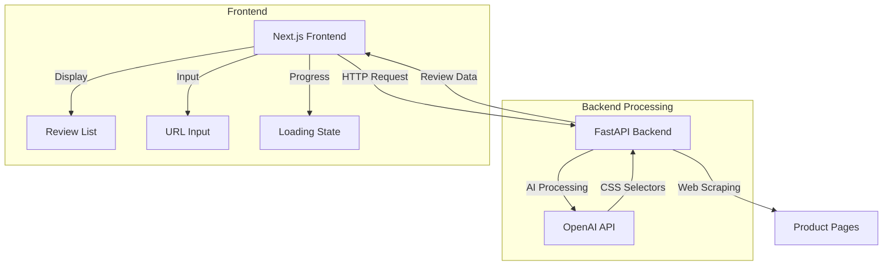

# AI-Powered Review Scraper

An application that automatically scrapes and extracts reviews from e-commerce product pages using AI for dynamic CSS identification. The system comprises a FastAPI backend for web scraping and a Next.js frontend for visualization.

## Demo
https://github.com/user-attachments/assets/e42ff3ed-2942-4987-bf86-9b3cae8bcb8d

## Architecture



## Technical Stack

### Backend
- FastAPI
- Playwright
- OpenAI API
- Python 3.11+

### Frontend
- Next.js 14
- TypeScript
- Tailwind CSS
- shadcn/ui

## Features

- Dynamic CSS selector identification using AI
- Real-time progress tracking
- Pagination handling
- Responsive UI
- Review visualization with ratings
- Error handling and loading states

## Local Testing Setup Instructions

### Backend Setup
1. Navigate to backend directory:
```bash
cd backend
```

2. Create virtual environment:
```bash
python -m venv .venv
source .venv/bin/activate  # Unix
.venv\Scripts\activate     # Windows
```

3. Install dependencies:
```bash
pip install -r requirements.txt
```

4. Install Playwright browsers:
```bash
playwright install
```

5. Create .env file:
```env
OPENAI_API_KEY=your_api_key_here
```

6. Run the server:
```bash
uvicorn app:app --reload
```

### Frontend Setup
1. Navigate to frontend directory:
```bash
cd frontend
```

2. Install dependencies:
```bash
npm install
```

3. Create .env.local:
```env
NEXT_PUBLIC_BACKEND_URL=http://localhost:8000
```

4. Run development server:
```bash
npm run dev
```

## API Documentation

### Endpoint: GET /api/reviews

Parameters:
- `page` (required): URL of the product page to scrape
- `max_count` (optional): Maximum number of reviews to fetch (default: 10000)

Example Request:
```bash
curl "http://localhost:8000/api/reviews?page=https://example.com/product"
```

Example Response:
```json
{
  "reviews_count": 23,
  "reviews": [
    {
      "title": "Great product",
      "body": "Really satisfied with the purchase",
      "rating": 5.0,
      "reviewer": "John D."
    }
  ],
  "pages_with_unique_reviews": 3,
  "url": "https://example.com/product",
  "scrape_date": "2025-01-21"
}
```

## Deployment

### Backend (Render)
1. Create new Web Service
2. Build Command:
```bash
pip install -r requirements.txt && playwright install chromium && playwright install-deps
```
3. Start Command:
```bash
./start.sh
```

### Frontend (Vercel)
1. Connect repository
2. Set environment variable:
```
NEXT_PUBLIC_BACKEND_URL=https://your-render-app.onrender.com
```
3. Deploy

## Error Handling

The application handles various scenarios:
- No reviews found
- Website loading failures
- Rate limiting
- CORS issues
- Timeout errors
